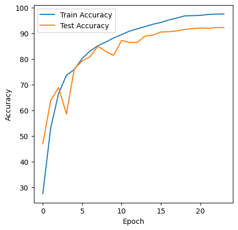
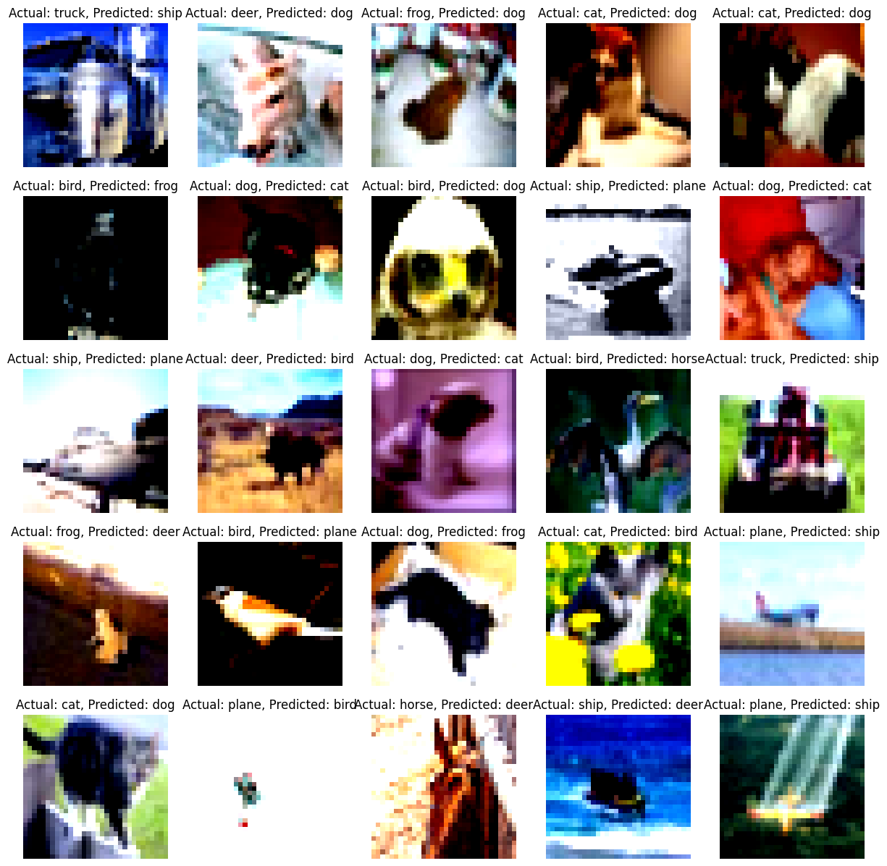
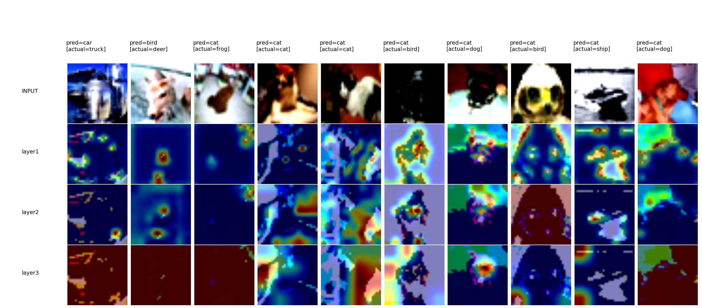
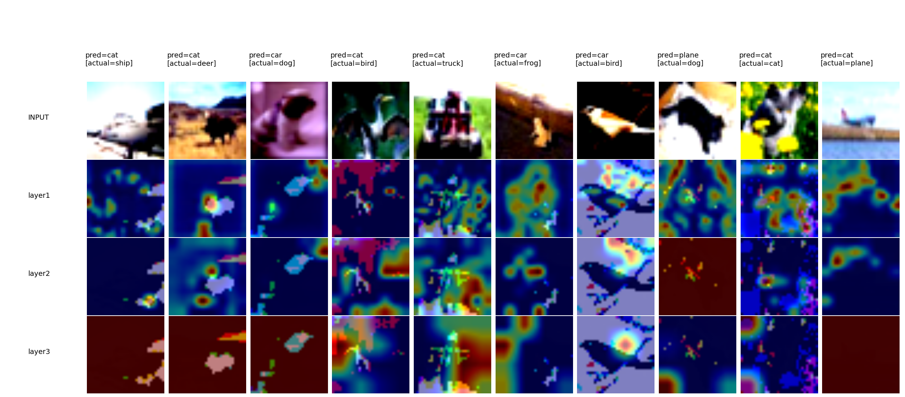
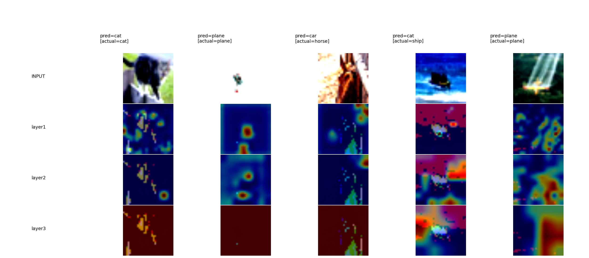

Assignment 10 
======================

Explanation
============
This Package trains a Deep Neural Network on CIFAR data. It's been packaged as per details below 

/data_loaders/cifar10_data_loader.py 
-------------------------------------
get_train_loader(batch_size, transform) : Loads the Training data and returns train loader 
get_test_loader(batch_size, transform)  : Loads the Test data and returns test loader 
get_classes()                           :  Returns the class labels 

data_transformations/data_transform_cifar10_custom_resnet.py
-------------------------------------------------------------

class album_Compose_train: 
    Defines all Transformation parameters
    Transforms and returns the modified image 
    
class album_Compose_test:
    Defines all Transformation parameters
    Transforms and returns the modified image 
    			
get_train_transform():
    Return Transformed Image
get_test_transform():
    Return Transformed Image
    
models/resnet18.py
------------------

The Custom Resnet18 Script is defined here 

PrepLayer - Conv 3x3 s1, p1) >> BN >> RELU [64k]
Layer1 -
X = Conv 3x3 (s1, p1) >> MaxPool2D >> BN >> RELU [128k]
R1 = ResBlock( (Conv-BN-ReLU-Conv-BN-ReLU))(X) [128k] 
Add(X, R1)
Layer 2 -
Conv 3x3 [256k]
MaxPooling2D
BN
ReLU
Layer 3 -
X = Conv 3x3 (s1, p1) >> MaxPool2D >> BN >> RELU [512k]
R2 = ResBlock( (Conv-BN-ReLU-Conv-BN-ReLU))(X) [512k]
Add(X, R2)
MaxPooling with Kernel Size 4
FC Layer 
SoftMax

models/main.py
------------------
    
def train_test_loader: Loads the data for training and testing 
  
def imshow(img): To display the image 
    
def get_model(CustomResNet) : Call the Resnet18 module and loads the model
  
def find_lr_value : Find the LR value 
      
def train_model : Trains the model 
    
    
utils/
-----

accuracy_utils.py                : Utility to calculate accuracy of training and testing 
cyclic_lr_plot.png               : Utility to plot clclic LR Plot
cyclic_lr_util.py
gradcamkz_util.py                : Gradcam Utility
misclassified_image_utils.py     : Utility to find misclassified images 
plot_metrics_utils.py            : Plot the Metrics
train_test_utils.py              : Train Test Utility
    
     
Constraints
-------------

Total Epochs = 24
Max at Epoch = 5
LRMIN = FIND
LRMAX = FIND
NO Annihilation
RandomCrop 32, 32 (after padding of 4) >> FlipLR >> Followed by CutOut(8, 8)
Batch size = 512
Target Accuracy: 90%

Result 
------
Achieved best accuracy of 92.18% in 24th epoch. From 16th epcoh itself achieved 90.45% and it steadily increases over epochs

Assumptions
-------------
With few more generalization we can achieve 93% accuracy and that's something i will try out 

Training Log
-------------

EPOCH: 1
  0%|          | 0/98 [00:00<?, ?it/s]/usr/local/lib/python3.10/dist-packages/torch/utils/data/dataloader.py:560: UserWarning: This DataLoader will create 4 worker processes in total. Our suggested max number of worker in current system is 2, which is smaller than what this DataLoader is going to create. Please be aware that excessive worker creation might get DataLoader running slow or even freeze, lower the worker number to avoid potential slowness/freeze if necessary.
  warnings.warn(_create_warning_msg(
/content/models/CustomResNet.py:76: UserWarning: Implicit dimension choice for log_softmax has been deprecated. Change the call to include dim=X as an argument.
  return F.log_softmax(out)
Loss=1.411113977432251 Batch_id=97 Accuracy=36.43: 100%|██████████| 98/98 [00:22<00:00,  4.36it/s]
Test set: Average loss: 1.5082, Accuracy: 4695/10000 (46.95%)

Test Accuracy: 46.95 has increased. Saving the model
EPOCH: 2
Loss=1.0982192754745483 Batch_id=97 Accuracy=56.35: 100%|██████████| 98/98 [00:23<00:00,  4.26it/s]
Test set: Average loss: 1.0285, Accuracy: 6373/10000 (63.73%)

Test Accuracy: 63.73 has increased. Saving the model
EPOCH: 3
Loss=0.8071767687797546 Batch_id=97 Accuracy=68.56: 100%|██████████| 98/98 [00:22<00:00,  4.38it/s]
Test set: Average loss: 0.8826, Accuracy: 6885/10000 (68.85%)

Test Accuracy: 68.85 has increased. Saving the model
EPOCH: 4
Loss=0.9618441462516785 Batch_id=97 Accuracy=74.10: 100%|██████████| 98/98 [00:22<00:00,  4.44it/s]
Test set: Average loss: 1.8162, Accuracy: 5851/10000 (58.51%)

EPOCH: 5
Loss=0.5504269599914551 Batch_id=97 Accuracy=77.32: 100%|██████████| 98/98 [00:23<00:00,  4.18it/s]
Test set: Average loss: 0.7232, Accuracy: 7611/10000 (76.11%)

Test Accuracy: 76.11 has increased. Saving the model
EPOCH: 6
Loss=0.5123278498649597 Batch_id=97 Accuracy=80.58: 100%|██████████| 98/98 [00:22<00:00,  4.42it/s]
Test set: Average loss: 0.6596, Accuracy: 7918/10000 (79.18%)

Test Accuracy: 79.18 has increased. Saving the model
EPOCH: 7
Loss=0.5362034440040588 Batch_id=97 Accuracy=82.98: 100%|██████████| 98/98 [00:22<00:00,  4.37it/s]
Test set: Average loss: 0.5677, Accuracy: 8082/10000 (80.82%)

Test Accuracy: 80.82 has increased. Saving the model
EPOCH: 8
Loss=0.4891194701194763 Batch_id=97 Accuracy=85.20: 100%|██████████| 98/98 [00:22<00:00,  4.33it/s]
Test set: Average loss: 0.4667, Accuracy: 8491/10000 (84.91%)

Test Accuracy: 84.91 has increased. Saving the model
EPOCH: 9
Loss=0.30674389004707336 Batch_id=97 Accuracy=86.46: 100%|██████████| 98/98 [00:22<00:00,  4.31it/s]
Test set: Average loss: 0.5405, Accuracy: 8288/10000 (82.88%)

EPOCH: 10
Loss=0.43060439825057983 Batch_id=97 Accuracy=87.89: 100%|██████████| 98/98 [00:23<00:00,  4.25it/s]
Test set: Average loss: 0.5693, Accuracy: 8137/10000 (81.37%)

EPOCH: 11
Loss=0.31362032890319824 Batch_id=97 Accuracy=89.30: 100%|██████████| 98/98 [00:22<00:00,  4.41it/s]
Test set: Average loss: 0.3956, Accuracy: 8718/10000 (87.18%)

Test Accuracy: 87.18 has increased. Saving the model
EPOCH: 12
Loss=0.2882494628429413 Batch_id=97 Accuracy=90.59: 100%|██████████| 98/98 [00:23<00:00,  4.23it/s]
Test set: Average loss: 0.4391, Accuracy: 8641/10000 (86.41%)

EPOCH: 13
Loss=0.28374379873275757 Batch_id=97 Accuracy=91.56: 100%|██████████| 98/98 [00:22<00:00,  4.39it/s]
Test set: Average loss: 0.4275, Accuracy: 8643/10000 (86.43%)

EPOCH: 14
Loss=0.266021192073822 Batch_id=97 Accuracy=92.33: 100%|██████████| 98/98 [00:21<00:00,  4.51it/s]
Test set: Average loss: 0.3639, Accuracy: 8887/10000 (88.87%)

Test Accuracy: 88.87 has increased. Saving the model
EPOCH: 15
Loss=0.21150729060173035 Batch_id=97 Accuracy=93.44: 100%|██████████| 98/98 [00:22<00:00,  4.28it/s]
Test set: Average loss: 0.3806, Accuracy: 8925/10000 (89.25%)

Test Accuracy: 89.25 has increased. Saving the model
EPOCH: 16
Loss=0.2029396891593933 Batch_id=97 Accuracy=94.28: 100%|██████████| 98/98 [00:21<00:00,  4.49it/s]
Test set: Average loss: 0.3304, Accuracy: 9045/10000 (90.45%)

Test Accuracy: 90.45 has increased. Saving the model
EPOCH: 17
Loss=0.13410969078540802 Batch_id=97 Accuracy=95.11: 100%|██████████| 98/98 [00:24<00:00,  4.06it/s]
Test set: Average loss: 0.3258, Accuracy: 9055/10000 (90.55%)

Test Accuracy: 90.55 has increased. Saving the model
EPOCH: 18
Loss=0.0893770307302475 Batch_id=97 Accuracy=95.86: 100%|██████████| 98/98 [00:21<00:00,  4.46it/s]
Test set: Average loss: 0.3238, Accuracy: 9087/10000 (90.87%)

Test Accuracy: 90.87 has increased. Saving the model
EPOCH: 19
Loss=0.08241406083106995 Batch_id=97 Accuracy=96.49: 100%|██████████| 98/98 [00:23<00:00,  4.26it/s]
Test set: Average loss: 0.3137, Accuracy: 9142/10000 (91.42%)

Test Accuracy: 91.42 has increased. Saving the model
EPOCH: 20
Loss=0.13268239796161652 Batch_id=97 Accuracy=96.79: 100%|██████████| 98/98 [00:22<00:00,  4.30it/s]
Test set: Average loss: 0.3167, Accuracy: 9179/10000 (91.79%)

Test Accuracy: 91.79 has increased. Saving the model
EPOCH: 21
Loss=0.09354635328054428 Batch_id=97 Accuracy=96.90: 100%|██████████| 98/98 [00:22<00:00,  4.45it/s]
Test set: Average loss: 0.3110, Accuracy: 9200/10000 (92.00%)

Test Accuracy: 92.0 has increased. Saving the model
EPOCH: 22
Loss=0.07091429829597473 Batch_id=97 Accuracy=97.20: 100%|██████████| 98/98 [00:23<00:00,  4.20it/s]
Test set: Average loss: 0.3102, Accuracy: 9191/10000 (91.91%)

EPOCH: 23
Loss=0.060054630041122437 Batch_id=97 Accuracy=97.30: 100%|██████████| 98/98 [00:21<00:00,  4.46it/s]
Test set: Average loss: 0.3088, Accuracy: 9216/10000 (92.16%)

Test Accuracy: 92.16 has increased. Saving the model
EPOCH: 24
Loss=0.09944024682044983 Batch_id=97 Accuracy=97.50: 100%|██████████| 98/98 [00:22<00:00,  4.29it/s]
Test set: Average loss: 0.3046, Accuracy: 9218/10000 (92.18%)

Test Accuracy: 92.18 has increased. Saving the model

Visualization
--------------

